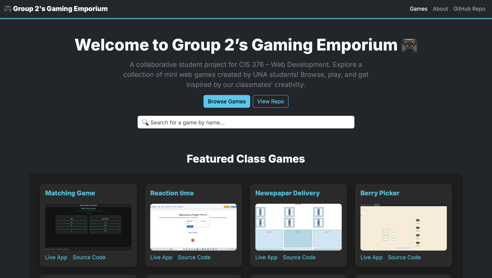

# 🎮 Group 2’s Gaming Emporium  
*A Collaborative Web Development Project – CIS 376 (UNA)*  

---

## 🧭 Overview
**Group 2’s Gaming Emporium** is a collaborative student project showcasing a collection of simple web-based games created by classmates in the **CIS 376 – Web Development** course at the **University of North Alabama**.  

Our site dynamically loads and displays data for each student’s deployed game—including the **game name**, **live link**, **source code**, and **preview image**—from a shared JSON dataset.  
This project demonstrates teamwork, data handling, responsive design, and accessibility best practices.

---

## 👥 Team Information
**Team Name:** Group 2 — DEV Charlie  

**Members:**
- [Saimon Hasan](https://github.com/Saimon215)  
- [Alex Copeland](https://github.com/Alex-Copeland-5)  
- [Jacobe Johnson](https://github.com/jacobej15)

---

## 🕹️ Product Description
**Product Name:** Group 2’s Gaming Emporium  
**Short Description:**  
A central web hub that aggregates all student games from the CIS 376 class.  
Users can **search**, **browse**, and **launch** games directly, viewing both their **deployed apps** and **GitHub repositories**.

---

## 💡 User Story
> As a **web development student**, I want to **view and explore my classmates’ games**,  
> so that I can **learn from their design and coding techniques**.

---

## ✅ Validation Results
- ✔️ HTML validated via **[Nu HTML Checker](https://validator.w3.org/nu/)**
- ✔️ CSS validated via **[W3C CSS Validator](https://jigsaw.w3.org/css-validator/)**
- ✔️ Accessibility verified with **[WAVE Accessibility Tool](https://wave.webaim.org/)**
- ✔️ No color contrast or ARIA fails detected
- ✔️ Fully responsive using **Bootstrap 5 grid system**

---

## 🧩 Code Base Overview
**Front-End Structure**
